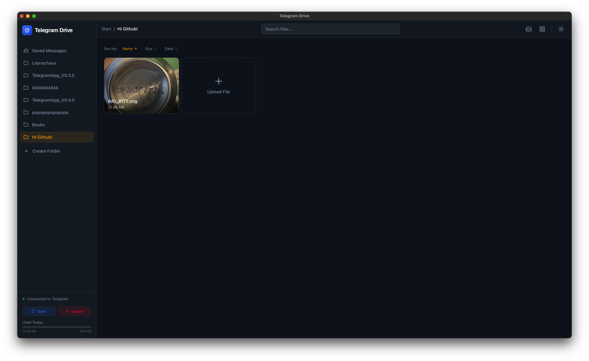
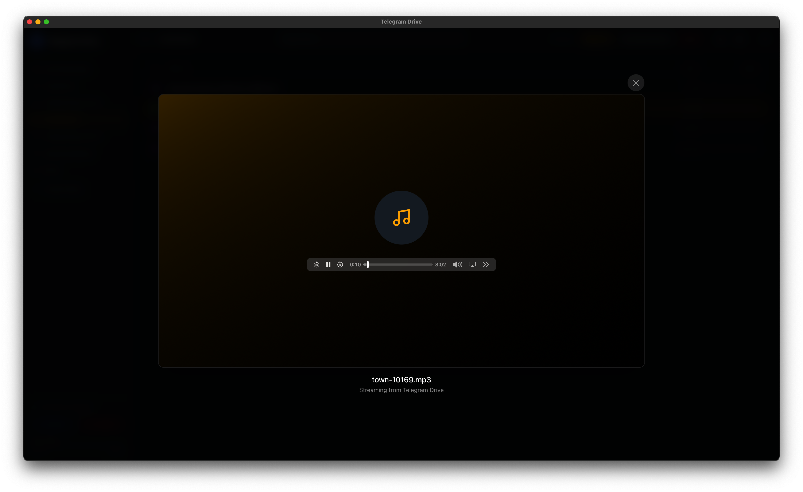
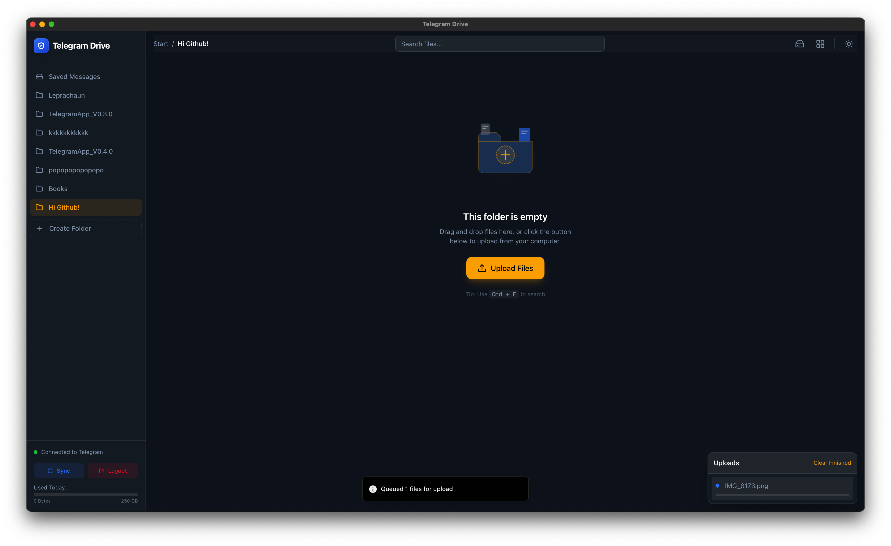
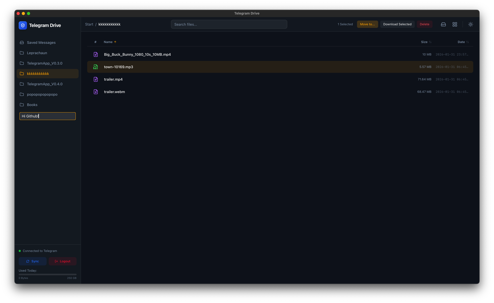

# Telegram Drive 

**Telegram Drive** is an open-source, cross-platform desktop application that turns your Telegram account into an unlimited, secure cloud storage drive. Built with **Tauri**, **Rust**, and **React**.


##  What is Telegram Drive?

Telegram Drive leverages the Telegram API to allow you to upload, organize, and manage files directly on Telegram's servers. It treats your "Saved Messages" and created Channels as folders, giving you a familiar file explorer interface for your Telegram cloud.

###  Key Features

*   **Unlimited Cloud Storage**: Utilizing Telegram's generous cloud infrastructure.
*   **High Performance Grid**: Virtual scrolling handles folders with thousands of files instantly.
*   **Auto-Updates**: Seamless updates for Windows, macOS, and Linux.
*   **Media Streaming**: Stream video and audio files directly without downloading.
*   **PDF Viewer:** Built-in PDF support with infinite scrolling for seamless document reading.
*   **Drag & Drop**: Intuitive drag-and-drop upload and file management.
*   **Thumbnail Previews**: Inline thumbnails for images and media files.
*   **Folder Management**: Create "Folders" (private Telegram Channels) to organize content.
*   **Privacy Focused**: API keys and data stay local. No third-party servers.
*   **Cross-Platform**: Native apps for macOS (Intel/ARM), Windows, and Linux.

##  Screenshots

| Dashboard | File Preview |
|-----------|--------------|
|  |  |

| Grid View | Authentication |
|-----------|----------------|
|  |  |

| Audio Playback | Video Playback |
|----------------|----------------|
|  |  |

| Auth Code Screen | Upload Example |
|------------------|-------------|
|  |  |

| Folder Creation | Folder List View |
|-----------------|------------------|
|  |  |

##  Tech Stack

*   **Frontend**: React, TypeScript, TailwindCSS, Framer Motion
*   **Backend**: Rust (Tauri), Grammers (Telegram Client)
*   **Build Tool**: Vite


##  Getting Started

### Prerequisites

Before you can run this project, make sure you have **all** of the following installed:

#### 1. Node.js (v18+)
Download from [nodejs.org](https://nodejs.org). Verify with:
```bash
node --version   # v18.x.x or higher
npm --version
```

#### 2. Rust (latest stable) + Cargo

Install via [rustup](https://rustup.rs) — the official Rust toolchain manager:

**macOS / Linux:**
```bash
curl --proto '=https' --tlsv1.2 -sSf https://sh.rustup.rs | sh
```

**Windows:**
Download and run **[rustup-init.exe](https://win.rustup.rs)** from https://rustup.rs

After installation, **restart your terminal**, then verify:
```bash
rustc --version   # e.g. rustc 1.78.0 (stable)
cargo --version   # e.g. cargo 1.78.0
```

> ⚠️ **Windows users — MSVC Build Tools required:** Rust on Windows uses the MSVC toolchain, which requires the **Visual C++ linker (`link.exe`)**. Without it, the build will fail with `linker 'link.exe' not found`.
>
> **Fix:** Install [Build Tools for Visual Studio](https://visualstudio.microsoft.com/visual-cpp-build-tools/) and during setup select the **"Desktop development with C++"** workload. Visual Studio Code is **not** sufficient — you need the Build Tools.

#### 3. WebView2 Runtime (Windows only)

Required for Tauri on Windows. Usually pre-installed on **Windows 10 (1803+)** and **Windows 11**. If missing, download from [Microsoft's WebView2 page](https://developer.microsoft.com/en-us/microsoft-edge/webview2/).

#### 4. Telegram API credentials

- A Telegram account
- An **API ID** and **API Hash** from [my.telegram.org](https://my.telegram.org)

> 💡 For the full official list of Tauri v2 prerequisites, see: https://v2.tauri.app/start/prerequisites/

---

### Installation

1.  **Clone the repository**
    ```bash
    git clone https://github.com/caamer20/Telegram-Drive.git
    cd Telegram-Drive
    ```

2.  **Install Node dependencies**
    ```bash
    cd app
    npm install
    ```
    > If you see vulnerability warnings, run `npm audit fix` to resolve them.

3.  **Run in Development Mode**
    ```bash
    npm run tauri dev
    ```
    > The first run will compile all Rust crates (~300+ dependencies) and may take **5–15 minutes** depending on your machine. Subsequent runs are much faster.

4.  **Build / Compile for Production**
    ```bash
    npm run tauri build
    ```

##  Open Source & License

This project is **Free and Open Source Software**. You are free to use, modify, and distribute it.

Licensed under the **MIT License**.

---
*Disclaimer: This application is not affiliated with Telegram FZ-LLC. Use responsibly and in accordance with Telegram's Terms of Service.*

If you're looking for a version of this app that's optimized for VPNs check out this repo:
https://github.com/caamer20/Telegram-Drive-ForVPNs

<div align="center">
  <!-- PayPal -->
  <div style="margin: 15px 0;">
    <a href="https://www.paypal.me/Caamer20">
      
    </a>
    <div style="font-size: 14px; margin-top: 8px;">paypal.me/Caamer20</div>
  </div>

  <!-- Litecoin -->
  <div style="margin: 15px 0;">
    <a href="litecoin:ltc1q6wkr5ac4u0pxx4hx7xgwn0gsaku25ws0df73rp">
      
    </a>
    <div style="font-family: monospace; font-size: 13px; margin-top: 8px; word-break: break-all;">
      ltc1q6wkr5ac4u0pxx4hx7xgwn0gsaku25ws0df73rp
    </div>
  </div>

  <!-- Bitcoin -->
  <div style="margin: 15px 0;">
    <a href="bitcoin:bc1q5pt7m2fk6w0dzsnf6vvd5k6nw5k44785286ujy">
      
    </a>
    <div style="font-family: monospace; font-size: 13px; margin-top: 8px; word-break: break-all;">
      bc1q5pt7m2fk6w0dzsnf6vvd5k6nw5k44785286ujy
    </div>
  </div>
</div>
