# Báo cáo Kiểm thử & Đánh giá (Audit) - Thiết kế lại tính năng Chuyển dữ liệu OneDrive

Tài liệu này thực hiện audit chi tiết hiện trạng kiến trúc, mã nguồn và luồng hoạt động của tính năng OneDrive Migration hiện tại trong hệ thống Telegram-Drive để chuẩn bị cho việc thiết kế lại.

---

## 1. Sơ đồ Luồng hoạt động hiện tại (Current Flow)

Dưới đây là sơ đồ mô tả luồng điều khiển và xử lý dữ liệu hiện tại từ React UI qua Tauri IPC đến SQLite, Worker nền, FFmpeg và Telegram:

```mermaid
sequenceDiagram
    autonumber
    actor User as Người dùng
    participant UI as React (AutoMigrationCenter.tsx)
    participant Hook as useMigration.ts Hook
    participant IPC as Tauri IPC (commands.rs)
    participant DB as SQLite Database (db.rs)
    participant Worker as Migration Worker (worker.rs)
    participant OD as Microsoft OneDrive API
    participant FF as FFmpeg Engine
    participant TG as Telegram API (via Grammers)

    User->>UI: Bật công tắc / Click "Quét & migrate"
    UI->>Hook: Gọi executeRescanAuto() hoặc startMigration()
    Hook->>IPC: Gọi Tauri Command cmd_migration_rescan_auto / cmd_migration_start
    IPC->>DB: Khởi tạo/Cập nhật Job trạng thái 'running'
    IPC->>Worker: Kích hoạt thread worker_loop_inner
    
    rect rgb(20, 30, 40)
        note right of Worker: Vòng lặp Worker chính (worker_loop_inner)
        Worker->>DB: Lấy item tiếp theo qua get_next_pending_media_item()
        DB-->>Worker: Trả về file video (nếu có) hoặc danh sách non-media
        
        alt Xử lý File Video (Media Priority)
            Worker->>OD: Tải file về vùng làm việc (.working/mig_*.part)
            OD-->>Worker: Download hoàn tất + tính toán SHA-256
            Worker->>DB: Check fingerprint SHA-256
            Worker->>FF: Transcode hoặc sao chép nguyên bản (Passthrough)
            FF-->>Worker: Trả về file video artifact
            Worker->>TG: Upload lên Telegram Drive (upload_core)
            TG-->>Worker: Thành công (Message ID)
            Worker->>DB: Cập nhật record_item_success (cộng Quota + lưu Fingerprint)
            Worker->>OD: Xóa file nguồn trên OneDrive (nếu là auto_job)
        else Xử lý Ảnh và các File khác (Non-media)
            note right of Worker: Chỉ chạy khi hàng đợi Video đã rỗng hoàn toàn!
            Worker->>OD: Tải file về vùng làm việc dưới NonVideo_Files
            OD-->>Worker: Download hoàn tất (.part -> rename final ghép kèm source_path)
            Worker->>DB: Đánh dấu item 'completed' (Không upload Telegram, không lưu fingerprint, không xóa OD)
        end
    end
    
    Worker-->>Hook: Phát Tauri Events (migration:item-progress, migration:item-complete)
    Hook-->>UI: Cập nhật State & Re-render giao diện
    UI-->>User: Hiển thị tiến trình thời gian thực
```



---

## 2. Bằng chứng Mã nguồn (File/Line Evidence)

Dưới đây là các bằng chứng cụ thể được trích xuất trực tiếp từ mã nguồn hiện tại nhằm xác minh các nhận định và lỗi thiết kế:

### 2.1. Component UI Monolithic
*   **Tệp tin**: [AutoMigrationCenter.tsx](file:///Users/manhtuong/Documents/GitHub/Telegram-Drive/app/src/components/migration/AutoMigrationCenter.tsx)
*   **Bằng chứng**: Tệp có dung lượng lớn, kéo dài từ dòng 1 đến dòng 1379 (tổng cộng 1.379 dòng).
*   **Vấn đề**: Component này chịu trách nhiệm hiển thị quá nhiều khối logic khác nhau: bảng danh sách tệp OneDrive phức tạp dạng cây Indented Tree (các dòng 225-397), thanh phân trang (dòng 1295-1319), các bộ lọc tìm kiếm và sắp xếp (dòng 961-1096), cùng bảng nhật ký hoạt động (dòng 1359-1370). Điều này làm tăng độ cồng kềnh và giảm khả năng bảo trì.

### 2.2. Hook quản lý quá nhiều State và Event Listeners
*   **Tệp tin**: [useMigration.ts](file:///Users/manhtuong/Documents/GitHub/Telegram-Drive/app/src/hooks/useMigration.ts)
*   **Bằng chứng**: Kéo dài từ dòng 1 đến dòng 1011. Khai báo hơn 13 biến trạng thái (state variables) khác nhau tại các dòng 64-79.
*   **Vấn đề**: Chứa đồng thời logic của kết nối Microsoft, quản lý CRUD Job, điều khiển tiến trình chạy, và một lượng lớn trình lắng nghe sự kiện Tauri (Event Listeners) ở `useEffect` từ dòng 356 đến 587 (lắng nghe các sự kiện: `job-state`, `item-progress`, `item-complete`, `stats`, `cooldown`, `activity`, `scan-progress`, `pipeline-error`, `snapshot-ready`).

### 2.3. Worker Rust có Độ phức tạp nhận thức (Cognitive Complexity) quá cao
*   **Tệp tin**: [worker.rs](file:///Users/manhtuong/Documents/GitHub/Telegram-Drive/app/src-tauri/src/migration/worker.rs)
*   **Bằng chứng**: Hàm `worker_loop_inner` kéo dài từ dòng 246 đến dòng 1400 (hơn 1.150 dòng mã nguồn).
*   **Vấn đề**: Chứa toàn bộ logic điều phối vòng lặp, kiểm tra token hết hạn, tải xuống tệp OneDrive, nén zip thư mục tài liệu, gọi transcode FFmpeg, upload Telegram và xóa dọn dẹp OneDrive. Độ phức tạp cực kỳ cao, không thể viết unit test riêng lẻ cho từng giai đoạn (stage).

### 2.4. Hàm ưu tiên Media chỉ trả về Video
*   **Tệp tin**: [db.rs](file:///Users/manhtuong/Documents/GitHub/Telegram-Drive/app/src-tauri/src/migration/db.rs#L910-L915)
*   **Bằng chứng**:
    ```rust
    pub fn get_next_pending_media_item(
        db: &MigrationDb,
        job_id: i64,
    ) -> Result<Option<MigrationItem>, String> {
        get_next_pending_video_item(db, job_id)
    }
    ```
*   **Vấn đề**: Hàm này chỉ định tuyến trực tiếp đến `get_next_pending_video_item`, nghĩa là chỉ lấy các file video. Ảnh hoàn toàn bị bỏ qua ở hàng đợi ưu tiên này.

### 2.5. Nhánh xử lý Non-Media bỏ qua ảnh lên Telegram Drive
*   **Tệp tin**: [worker.rs](file:///Users/manhtuong/Documents/GitHub/Telegram-Drive/app/src-tauri/src/migration/worker.rs#L390-L420)
*   **Bằng chứng**:
    ```rust
    // Scanning finished and all priority media files processed.
    // Now download remaining non-media files to local working directory (no Telegram upload, no OneDrive deletion)!
    let non_media_items = get_pending_items_by_job(&mig_state.db, job_id)?;
    if !non_media_items.is_empty() {
        ...
        for nm_item in non_media_items {
            ...
            let file_dest_path = base_local_non_media_dir.join(&nm_item.source_path);
            ...
            let dl_res = download_item(...)
    ```
*   **Vấn đề**: Do hình ảnh (png, jpg,...) không được nhận diện ở bước 2.4, chúng bị phân loại là `non_media_items` và đi vào nhánh này. Các file này bị ghép trực tiếp `source_path` tương đối vào thư mục `NonVideo_Files` (không phải lưu phẳng) thay vì được upload lên Telegram Drive.

### 2.6. Xóa dữ liệu nguồn OneDrive một cách nguy hiểm (Destructive Action)
*   **Tệp tin**: [worker.rs](file:///Users/manhtuong/Documents/GitHub/Telegram-Drive/app/src-tauri/src/migration/worker.rs#L1319-L1346) và [worker.rs](file:///Users/manhtuong/Documents/GitHub/Telegram-Drive/app/src-tauri/src/migration/worker.rs#L748-L775)
*   **Bằng chứng**:
    ```rust
    // Remove the OneDrive source only after Telegram confirms the upload.
    if auto_job {
        if let Some(source_id) = item.source_item_id.as_deref() {
            if let Err(error) =
                delete_onedrive_item(&http, &access_token, source_id).await
            { ... }
        }
    }
    ```
*   **Vấn đề**: Worker tự động thực hiện lệnh xóa tệp nguồn OneDrive khi `auto_job` bằng true. Đây là hành vi phá hủy (destructive) cực kỳ nghiêm trọng, vi phạm nguyên tắc an toàn dữ liệu của người dùng.

### 2.7. Sử dụng hằng số GiB không nhất quán với nhãn GB trên UI
*   **Tệp tin**: [AutoMigrationCenter.tsx](file:///Users/manhtuong/Documents/GitHub/Telegram-Drive/app/src/components/migration/AutoMigrationCenter.tsx#L455) và [db.rs](file:///Users/manhtuong/Documents/GitHub/Telegram-Drive/app/src-tauri/src/migration/db.rs#L1103-L1119)
*   **Bằng chứng**:
    *   Frontend: `const uploadedGB = dailyQuota ? (dailyQuota.uploaded_bytes / (1024 * 1024 * 1024)).toFixed(2) : '0.00';` (sử dụng mẫu số $1024^3$ tức là đơn vị GiB). Nhưng UI hiển thị nhãn là "GB" (hằng số 250GB).
    *   Backend: Hàm `record_item_success` nhận `file_size` (kích thước tệp nguồn OneDrive gốc) để cộng dồn vào `daily_migration_quota`.
*   **Vấn đề**: Việc tính toán quota dựa trên kích thước file nguồn gốc (source size) là sai, vì sau khi qua FFmpeg transcode, dung lượng thực tế được upload lên Telegram (artifact size) có thể thay đổi. Đồng thời, có sự nhầm lẫn hiển thị giữa GB (hệ thập phân, $1000^3$ bytes) và GiB (hệ nhị phân, $1024^3$ bytes).

### 2.8. Lịch sử trùng lặp (Dedupe History) không bao phủ tệp Local-Only
*   **Tệp tin**: [worker.rs](file:///Users/manhtuong/Documents/GitHub/Telegram-Drive/app/src-tauri/src/migration/worker.rs#L440-L481)
*   **Bằng chứng**: Nhánh xử lý `non_media_items` chỉ ghi nhận trạng thái 'completed' vào bảng `migration_items` sau khi tải xuống thành công, tuyệt đối không chèn vân tay (fingerprint) vào bảng `migrated_fingerprints`.
*   **Vấn đề**: Hệ thống không lưu lại vân tay của các tệp chỉ lưu cục bộ (local-only), dẫn đến không thể phát hiện trùng lặp cho các file này trong các lần quét hoặc các job chạy sau.

### 2.9. Bộ phân tích lỗi Upload chưa nhận diện FLOOD_PREMIUM_WAIT_X
*   **Tệp tin**: [upload_adapter.rs](file:///Users/manhtuong/Documents/GitHub/Telegram-Drive/app/src-tauri/src/migration/upload_adapter.rs#L69-L84)
*   **Bằng chứng**:
    ```rust
    pub fn parse_flood_wait_seconds(err_str: &str) -> Option<i64> {
        if let Some(idx) = err_str.find("FLOOD_WAIT_") { ... }
        else if let Some(idx) = err_str.find("flood wait") { ... }
        else { None }
    }
    ```
*   **Vấn đề**: Telegram API mới trả về mã lỗi `FLOOD_PREMIUM_WAIT_X` đối với tài khoản Premium khi bị giới hạn tần suất. Bộ lọc này chỉ tìm kiếm chuỗi `"FLOOD_WAIT_"`, do đó sẽ bỏ qua `FLOOD_PREMIUM_WAIT_` (vì có chữ `PREMIUM` chen giữa), khiến hệ thống không chuyển sang chế độ cooldown phù hợp.

### 2.10. Thiếu Integration Test cho Pipeline điều phối chính
*   **Thư mục**: [src-tauri/src/migration/](file:///Users/manhtuong/Documents/GitHub/Telegram-Drive/app/src-tauri/src/migration)
*   **Bằng chứng**: Mặc dù module migration hiện đã có một số unit tests (ví dụ [transferState.test.ts](file:///Users/manhtuong/Documents/GitHub/Telegram-Drive/app/src/components/migration/transferState.test.ts)), hệ thống vẫn hoàn toàn thiếu các bài end-to-end integration test cho worker routing, pipeline overlap và crash recovery.

---

## 3. Phân tích Khoảng cách (Gap Analysis)

| Yêu cầu mới (Target Specification) | Trạng thái hiện tại | Khoảng cách & Giải pháp kỹ thuật |
| :--- | :--- | :--- |
| **Định tuyến Video**<br>Download OD → FFmpeg probe & remux/transcode (H.264/AAC, 1080p balanced) → Upload TD. | Chạy passthrough trực tiếp hoặc gọi nén đơn luồng. | **Passthrough vs Remux**: Phiên bản cũ gọi việc trả về file gốc không qua xử lý là "passthrough compatible". Phiên bản mới yêu cầu mọi file video tương thích vẫn phải đi qua nhánh FFmpeg để remux đổi container (`-c copy`) khi phù hợp.<br>**Giải pháp**: Sửa định tuyến video đi qua module FFmpeg xử lý thống nhất. |
| **Định tuyến Ảnh**<br>Download nguyên bản → Upload TD (không FFmpeg). | Bị bỏ sót, đẩy xuống local-only. | **Khoảng cách**: Ảnh không được đưa lên Telegram Drive.<br>**Giải pháp**: Nhận diện loại file ảnh và định tuyến qua `image_to_td` độc lập. |
| **Định tuyến File Khác**<br>Chỉ lưu local, giữ cấu trúc thư mục tương đối, không lên TD. | Lưu dưới thư mục phẳng `NonVideo_Files` kèm tương đối. | **Khoảng cách**: Cần bảo đảm đường dẫn an toàn dưới normalized backup root.<br>**Giải pháp**: Thực hiện validate path safety chặt chẽ tránh path traversal. |
| **An toàn dữ liệu nguồn**<br>Không bao giờ xóa/thay đổi file trên OneDrive. | Tự động xóa file nguồn OneDrive sau khi upload thành công (`auto_job = true`). | **Khoảng cách**: Hành vi phá hủy dữ liệu gốc.<br>**Giải pháp**: Gỡ bỏ 100% lệnh gọi `delete_onedrive_item` trong toàn bộ migration path. |
| **Cơ chế chống trùng lặp (Dedupe)**<br>Dedupe theo target key. Chọn 1 canonical item, các bản sao tham chiếu qua `duplicate_of_item_id`. | Dùng chung một fingerprint global duy nhất cho mọi đích vật lý. | **Khoảng cách**: Nếu file cần tồn tại ở cả local và Telegram, dedupe global sẽ skip nhầm.<br>**Giải pháp**: Sử dụng `artifact_target_key` để phân tách dedupe scope theo đích đến (`telegram` hoặc `local`). |
| **Bảo vệ Telegram Quota**<br>Hạn mức 250,000,000,000 bytes/ngày local. Không cho phép bỏ qua. | Quota tính theo source size. Cho phép bỏ qua trên UI. | **Khoảng cách**: Quota không chính xác và thiếu an toàn.<br>**Giải pháp**: Đổi sang hard cap byte chính xác. Xóa cơ chế bỏ qua giới hạn trên UI. |
| **Telegram Safety Guard**<br>Pacing 3 giây, cooldown 120 giây sau mỗi 100 file, xử lý `FLOOD_PREMIUM_WAIT`. | Chưa có pacing cố định, chưa có `FLOOD_PREMIUM_WAIT`. | **Khoảng cách**: Nguy cơ spam bị giới hạn tần suất (burst lock).<br>**Giải pháp**: Thêm pacing state lưu bền vững, giảm burst và tuân thủ cooldown của Telegram. |

---

## 4. Rủi ro Dữ liệu & Hành vi Phá hủy (Data Risks & Destructive Behaviors)

1.  **Mất mát dữ liệu nguồn (Data Loss)**: Logic xóa tệp OneDrive tự động khi di chuyển thành công (`worker.rs:1319`) gây nguy hiểm lớn nếu người dùng chưa có bản sao lưu khác. Cần loại bỏ 100% logic xóa dữ liệu nguồn OneDrive.
2.  **Tràn đĩa cứng cục bộ (Local Disk Full)**: Việc tải xuống đồng thời nhiều file lớn mà không có giới hạn dung lượng đệm (backpressure) sẽ nhanh chóng làm đầy ổ cứng. Cần thiết kế stage boundary với cơ chế kiểm tra dung lượng trống khả dụng.
3.  **Tải trùng lặp do lỗi Transaction trên DB (Idempotency Recovery)**: Nếu worker tải lên Telegram thành công nhưng crash trước khi ghi nhận SQLite, hệ thống sẽ upload lại gây trùng lặp. Cần cơ chế idempotent upload sử dụng persisted `random_id`.
