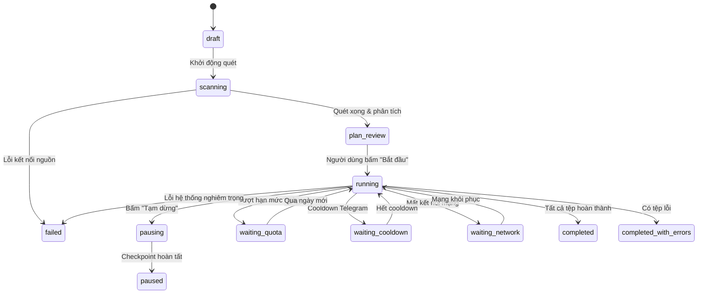

# Mô hình Dữ liệu (Data Model) - Chuyển dữ liệu OneDrive

Tài liệu này định nghĩa cấu trúc bảng SQLite, máy trạng thái (state machines), các định tuyến xử lý tệp (route kinds) và cơ chế giao dịch chống trùng lặp/quota cho tính năng di chuyển OneDrive được thiết kế lại.

---

## 1. Máy trạng thái (State Machines)

### 1.1. Trạng thái Job (Job States)
*   `draft`: Người dùng vừa vào trang, chưa quét cấu trúc thư mục.
*   `scanning`: Hệ thống đang quét đệ quy cấu trúc OneDrive và xây dựng snapshot.
*   `plan_review`: Đã quét xong, hiển thị kế hoạch di chuyển và thống kê tài nguyên.
*   `running`: Pipeline di chuyển đang chạy tích cực.
*   `pausing`: Đang chờ các stage hiện tại lưu checkpoint an toàn.
*   `paused`: Đã dừng hoàn toàn các luồng xử lý.
*   `waiting_quota`: Tạm dừng do hết hạn mức quota ngày local.
*   `waiting_cooldown`: Tạm dừng do chờ hết hạn cooldown Telegram (`FLOOD_WAIT` / `FLOOD_PREMIUM_WAIT`).
*   `waiting_network`: Tạm dừng do mất kết nối mạng.
*   `completed`: Tất cả tệp tin trong snapshot đã được xử lý xong thành công (hoặc bỏ qua trùng).
*   `completed_with_errors`: Job hoàn tất nhưng có tệp bị lỗi không thể retry.
*   `cancelled`: Người dùng chủ động hủy Job.
*   `failed`: Job dừng lại do gặp lỗi hệ thống nghiêm trọng (đĩa cứng đầy, lỗi bảo mật).



### 1.2. Trạng thái Tệp tin (Item States) & Các Stage
*   `pending`: Tệp đang đợi để đưa vào pipeline.
*   `waiting_duplicate`: Tệp bản sao đang chờ tệp bản gốc (canonical) xử lý xong.
*   `downloading`: Đang tải tệp từ OneDrive về `.working/download/`.
*   `downloaded`: Tải xuống thành công.
*   `transcoding`: Đang xử lý qua FFmpeg (transcode hoặc remux).
*   `ready_upload`: Tệp đã sẵn sàng ở vùng đệm để chuẩn bị upload.
*   `waiting_quota`: Tệp đang chờ cấp phát quota ngày.
*   `uploading`: Đang tải lên Telegram.
*   `reconciliation_required`: Gặp lỗi không rõ trạng thái upload (cần đối soát thủ công).
*   `local_committing`: Đang di chuyển file từ vùng tạm sang thư mục lưu trữ cục bộ.
*   `completed`: Tệp xử lý hoàn tất thành công.
*   `skipped_duplicate`: Tệp bị bỏ qua do trùng lặp vân tay.
*   `retry_wait`: Đang chờ để tải lại/upload lại sau khi gặp lỗi tạm thời.
*   `failed`: Tệp thất bại hoàn toàn sau 3 lần retry.

---

## 2. Các Định tuyến Xử lý (Route Kinds)

1.  `video_to_td`: Download → FFmpeg (remux `-c copy` hoặc transcode) → Upload lên Telegram Drive.
2.  `image_to_td`: Download (staging area) → Upload trực tiếp nguyên bản lên Telegram Drive.
3.  `other_to_local`: Download về vùng tạm `.working` → Di chuyển (Atomic Rename) sang thư mục `OneDrive_Archive/[Relative Path]` cục bộ (bao gồm cả việc tạo thư mục rỗng).

---

## 3. Cấu trúc Database SQLite Đề xuất (DB Schema Design)

### 3.1. Bảng `migration_jobs` (Bổ sung trường tương thích)
```sql
ALTER TABLE migration_jobs ADD COLUMN pipeline_version INTEGER NOT NULL DEFAULT 1;
```
*   `pipeline_version`: Job cũ sẽ có version = 1; Job thiết kế mới có version = 2.
*   **Quy tắc tương thích**: Giữ nguyên lịch sử job cũ. Không thực hiện mass-update route của các item thuộc Job v1. Nếu phát hiện Job v1 chưa hoàn tất, hệ thống sẽ tự động pause/archive an toàn và UI đề nghị người dùng tạo snapshot v2 mới.

### 3.2. Bảng `migration_items` (Cập nhật cột)
```sql
ALTER TABLE migration_items ADD COLUMN route_kind TEXT NOT NULL DEFAULT 'other_to_local';
ALTER TABLE migration_items ADD COLUMN duplicate_of_item_id INTEGER REFERENCES migration_items(id);
ALTER TABLE migration_items ADD COLUMN artifact_size_bytes INTEGER;
ALTER TABLE migration_items ADD COLUMN local_dest_path TEXT;
ALTER TABLE migration_items ADD COLUMN telegram_random_id INTEGER;
ALTER TABLE migration_items ADD COLUMN upload_attempt_id TEXT;
```

### 3.3. Bảng `migrated_fingerprints` (Lịch sử trùng lặp toàn cục)
```sql
CREATE TABLE IF NOT EXISTS migrated_fingerprints (
    id                      INTEGER PRIMARY KEY AUTOINCREMENT,
    fingerprint_type        TEXT NOT NULL CHECK(fingerprint_type IN ('onedrive_quickxor', 'onedrive_sha1', 'sha256')),
    fingerprint_value       TEXT NOT NULL,
    file_size               INTEGER NOT NULL,
    artifact_target_key     TEXT NOT NULL, -- 'telegram:<dest_id>' hoặc 'local:<normalized-backup-root>'
    telegram_destination_id INTEGER,
    telegram_message_id     INTEGER,
    local_absolute_path     TEXT,
    completed_at            INTEGER NOT NULL,
    UNIQUE(fingerprint_type, fingerprint_value, file_size, artifact_target_key)
);
```

### 3.4. Bảng `quota_reservations` (Quản lý giữ chỗ Quota tạm thời)
```sql
CREATE TABLE IF NOT EXISTS quota_reservations (
    item_id                 INTEGER PRIMARY KEY REFERENCES migration_items(id),
    job_id                  INTEGER NOT NULL,
    date_string             TEXT NOT NULL,
    reserved_bytes          INTEGER NOT NULL,
    status                  TEXT NOT NULL DEFAULT 'reserved' CHECK(status IN ('reserved', 'committed', 'released')),
    created_at              INTEGER NOT NULL,
    expires_at              INTEGER NOT NULL
);
```

---

## 4. Cơ chế Giao dịch & Chống trùng lặp (Dedupe & Quota Transaction Logic)

### 4.1. Phân bổ Canonical Claim & Promotion theo Đích đến
*   Vân tay của mỗi tệp tin được so sánh dựa trên khóa duy nhất:
    `fingerprint_type + fingerprint_value + source_size + artifact_target_key`
*   Khi quét snapshot, nếu phát hiện trùng lặp vân tay trên cùng đích đến (`artifact_target_key`), tệp đầu tiên được gán làm canonical. Các bản sao còn lại chuyển sang trạng thái `waiting_duplicate` và lưu `duplicate_of_item_id`.
*   Nếu tệp canonical thành công, tất cả các tệp `waiting_duplicate` được cập nhật thành `skipped_duplicate` và kế thừa kết quả.
*   Nếu tệp canonical lỗi (attempt = 3), hệ thống tự động tìm bản sao tiếp theo ở trạng thái `waiting_duplicate`, cập nhật nó thành canonical mới (`duplicate_of_item_id = NULL`), chuyển trạng thái về `pending` và trỏ các bản sao còn lại về canonical mới này.

### 4.2. Khôi phục Quota Reservation sau Crash
Khi khởi động ứng dụng hoặc khi ngày local của hệ thống thay đổi:
1.  Hệ thống thực hiện quét bảng `quota_reservations`.
2.  Mọi bản ghi có trạng thái `'reserved'` và có `expires_at` nhỏ hơn thời gian hiện tại hoặc có `date_string` khác ngày local hiện tại sẽ tự động bị xóa (release quota thừa bị kẹt do crash).

### 4.3. Cấu hình SQLite WAL & Sync
Để đảm bảo an toàn tối đa cho DB khi ghi nhận trạng thái và log liên tục:
```sql
PRAGMA journal_mode = WAL;
PRAGMA synchronous = FULL; -- Không dùng synchronous = NORMAL theo Constitution
```
